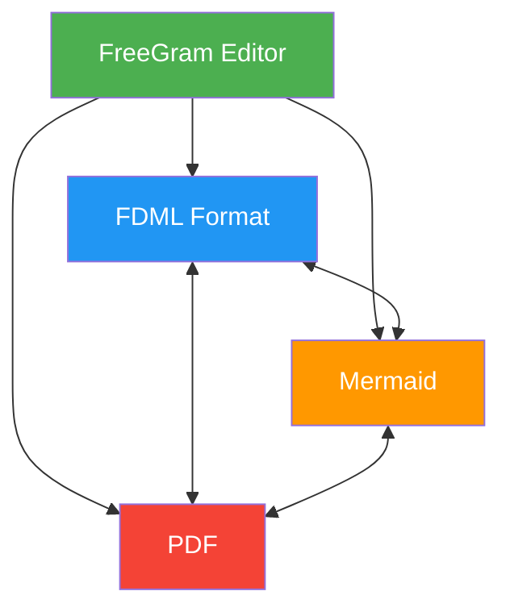
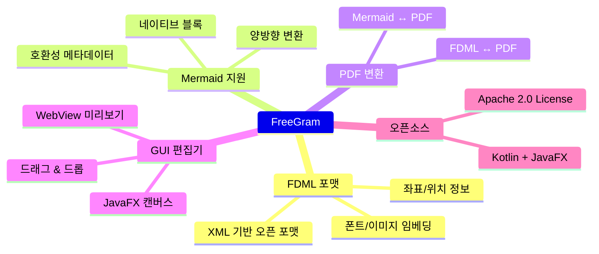
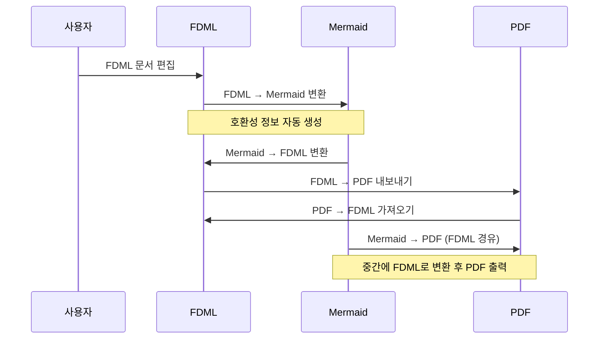
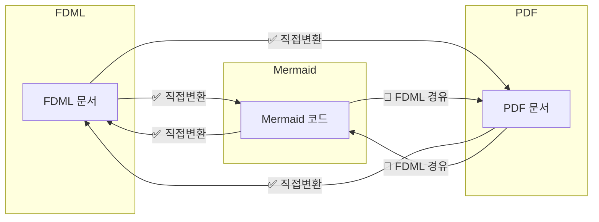
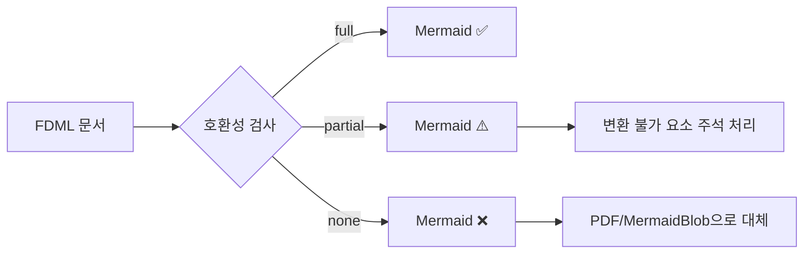

# FreeGram

**FreeGram**은 Kotlin + JavaFX로 제작된 **다이어그램 문서 편집도구**입니다.  
**FDML**(FreeDiagram Markup Language)이라는 XML 기반 오픈 포맷을 사용하며, **Mermaid** 다이어그램을 완전히 지원합니다.  
FDML, Mermaid, PDF 간 **3자 상호변환**이 가능합니다.



## 주요 기능



- **FDML 포맷** — XML 기반 자체 오픈 포맷, 모든 요소에 x/y 좌표 정보 포함
- **Mermaid 지원** — 네이티브 Mermaid 블록 + Mermaid 문법으로 양방향 변환
- **PDF 변환** — FDML ↔ Mermaid ↔ PDF **3자 상호변환**
- **Mermaid 호환성 메타데이터** — 문서별로 `full` / `partial` / `none` 호환성 수준과 변환 불가 사유 명시
- **리소스 임베딩** — 폰트, 이미지, 파일을 base64로 XML 내부에 직접 포함
- **GUI 편집기** — JavaFX 캔버스 기반, 드래그 이동, 속성 편집, Mermaid WebView 실시간 미리보기
- **크로스 플랫폼** — Java 17+ 만 있으면 Linux, Windows, macOS 어디서든 실행

## 변환 흐름



## 빠른 시작

```bash
# 사전 요구사항: Java 17+, JavaFX 17+
java --module-path $JAVAFX_PATH --add-modules javafx.controls,javafx.web,javafx.swing -jar freegram-1.0.0.jar
```

또는 플랫폼별 런처 사용:

```bash
# Linux
chmod +x freegram-linux.sh && ./freegram-linux.sh

# Windows (더블클릭 또는 cmd)
freegram-windows.bat
```

## 소스에서 빌드

```bash
git clone https://github.com/hslcrb/freegram.git
cd freegram
./gradlew build
```

JAR 파일: `build/libs/freegram-1.0.0-all.jar`

## FDML 포맷 (`.fdml`)

FDML은 `https://freegram.dev/fdml/1.0` 네임스페이스를 사용하는 XML 기반 다이어그램 포맷입니다.

### 주요 요소

| 요소 | 설명 | 주요 속성 |
|------|------|-----------|
| `<node>` | 다이어그램 노드 | `x`, `y`, `width`, `height`, shape type |
| `<edge>` | 노드 간 연결선 | `source`, `target`, waypoints, label |
| `<mermaid>` | 네이티브 Mermaid 코드 블록 | `x`, `y`, `native` |
| `<pdf>` | 임베디드 PDF 요소 | `x`, `y`, `page` |
| `<group>` | 요소 그룹 (중첩 가능) | `x`, `y` |
| `<text>` | 자유 텍스트 (위치 정보 포함) | `x`, `y`, `fontSize` |
| `<font>` | base64 임베디드 폰트 | `fontFamily`, `fontWeight` |
| `<image>` | base64 임베디드 이미지 | `mimeType` |

### 예제

```xml
<fdml version="1.0" xmlns="https://freegram.dev/fdml/1.0">
  <metadata>
    <title>내 다이어그램</title>
    <mermaidCompatibility level="partial">
      <incompatibleReason>PDF 요소는 Mermaid로 변환 불가</incompatibleReason>
    </mermaidCompatibility>
  </metadata>
  <resources>
    <font id="f1" fontFamily="Noto Sans">...base64...</font>
  </resources>
  <diagram width="1200" height="900">
    <node id="n1" x="100" y="100" width="160" height="60">
      <style fillColor="#4CAF50"/>
      <content>시작</content>
    </node>
    <edge id="e1" source="n1" target="n2" type="arrow">
      <label>다음</label>
      <waypoint x="180" y="160"/>
    </edge>
    <mermaid id="m1" x="500" y="100" native="true">
      <code><![CDATA[graph TD; A[Start] --> B[End];]]></code>
    </mermaid>
    <text id="t1" x="420" y="200" fontSize="12">
      <content>위치가 고정된 텍스트</content>
    </text>
  </diagram>
</fdml>
```

## 3자 상호변환 매트릭스



| From \\ To | FDML | Mermaid | PDF |
|-----------|------|---------|-----|
| **FDML** | — | ✅ 직접 | ✅ 직접 |
| **Mermaid** | ✅ 직접 | — | ✅ FDML 경유 |
| **PDF** | ✅ 직접 | ✅ FDML 경유 | — |

## Mermaid 호환성 수준

FDML 문서는 `<mermaidCompatibility>` 요소로 Mermaid 변환 가능성을 명시합니다:

| 수준 | 의미 | 예시 |
|------|------|------|
| `full` | 완벽히 Mermaid로 변환 가능 | 노드와 엣지만 있는 단순 플로우차트 |
| `partial` | 일부 요소만 변환 불가 | 자유텍스트(위치정보 손실), 확장 블록 |
| `none` | Mermaid 변환 불가 | PDF 임베디드 문서 |



## 라이선스

Apache 2.0 — [LICENSE](LICENSE) 참조
